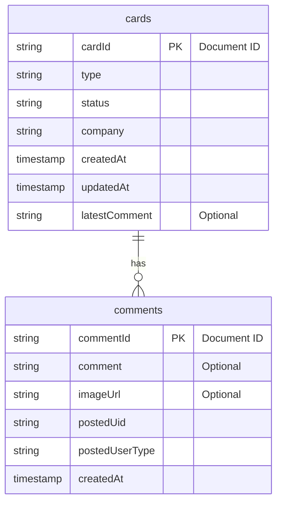

# flutter_sample

A new Flutter project.

## Getting Started

This project is a starting point for a Flutter application.

A few resources to get you started if this is your first Flutter project:

- [Lab: Write your first Flutter app](https://docs.flutter.dev/get-started/codelab)
- [Cookbook: Useful Flutter samples](https://docs.flutter.dev/cookbook)

For help getting started with Flutter development, view the
[online documentation](https://docs.flutter.dev/), which offers tutorials,
samples, guidance on mobile development, and a full API reference.

## 機能一覧

| カテゴリ             | 機能                                                                                                                               | 詳細                                                                                                                                                                                                                                                                                                                         |
| -------------------- | ---------------------------------------------------------------------------------------------------------------------------------- | ---------------------------------------------------------------------------------------------------------------------------------------------------------------------------------------------------------------------------------------------------------------------------------------------------------------------------- |
| **ユーザー認証機能** | **メールアドレスとパスワードによるログイン**                                                                                             | ユーザーはメールアドレスとパスワードを使用してサインインできます。 不正なログイン試行（例：「パスワードが間違っています」、「ユーザーが見つかりません」）に対して、適切なエラーメッセージを表示します。                                                                                                                                                             |
|                      | **ユーザーログアウト**                                                                                                                 | 認証済みのユーザーはアプリケーションからサインアウトできます。                                                                                                                                                                                                                                                                             |
|                      | **認証状態の永続化**                                                                                                               | アプリケーションはユーザーのログイン状態を記憶します（Firebase Authenticationによる）。                                                                                                                                                                                                                                                      |
|                      | **初期認証確認**                                                                                                                   | アプリケーション起動時にユーザーの認証状態を確認し、ログインページまたはメインコンテンツ（カード一覧ページ）に誘導します（`FirebaseConnect` の使用から推測）。                                                                                                                                                                                                |
| **カード管理機能**   | **新規カード作成**                                                                                                                   | ユーザーは新しいカードを追加できます。 新規カードはデフォルト値（`type`: "new", `status`: "draft"）で初期化され、ユーザーの所属する `company`/`organization` に関連付けられます。 タイムスタンプ（`createdAt`, `updatedAt`）が自動的に追加されます。                                                                                                               |
|                      | **カード一覧表示**                                                                                                                   | ユーザーはカードの一覧を閲覧できます。 一覧は、ユーザーの所属する `organization` のカードのみにフィルタリングされます。 カードは `updatedAt` タイムスタンプの降順（最新更新順）で並べ替えられます。 一覧には主要なカード情報（`type`, `ID`, `updatedAt`, `status`）が表示されます。                                                                                              |
|                      | **カード詳細表示**                                                                                                                   | ユーザーは一覧からカードを選択して詳細情報を閲覧できます。 カードの `type`, `status`, `company` が表示されます。                                                                                                                                                                                                                               |
| **コメント機能**     | **テキストコメント追加**                                                                                                               | ユーザーはカードにテキストコメントを追加できます。 コメントは投稿したユーザー（`postedUid`, `postedUserType`）に関連付けられます。 各コメントには `createdAt` タイムスタンプが記録されます。 コメントを追加すると、親カードの `latestComment` フィールドがコメントテキストで更新され、`updatedAt` タイムスタンプも更新されます。                                                                   |
|                      | **画像コメントアップロード**                                                                                                           | ユーザーは画像をコメントとしてアップロードできます。 画像はファイルピッカー経由で選択されます。 画像はFirebase Storageに、カードIDとタイムスタンプに基づいて整理されてアップロードされます。 アップロードの進捗状況が監視されます。 アップロード成功後、画像のダウンロードURLがコメントレコードに保存されます。 画像コメントも `postedUid` と `postedUserType` に関連付けられます。 画像コメントを追加すると、親カードの `latestComment` フィールドが「画像がアップロードされました」というテキストで更新され、`updatedAt` タイムスタンプも更新されます。 |
|                      | **コメント表示**                                                                                                                   | コメント（テキストおよび画像）はカード詳細ページに表示されます。 コメントは `createdAt` タイムスタンプの降順（最新のものから順）で表示されます。 アップロードされた画像は、対応するコメントエントリと共に表示されます。                                                                                                                                                     |
| **アプリ構造**       | **フロントエンド**                                                                                                                   | Flutterで構築されています。                                                                                                                                                                                                                                                                                                              |
|                      | **状態管理**                                                                                                                     | Riverpodを使用しています。                                                                                                                                                                                                                                                                                                               |
|                      | **バックエンド**                                                                                                                   | Firebase（データベースとしてFirestore、画像ファイル用にFirebase Storage、ユーザー管理用にFirebase Authentication）を利用しています。                                                                                                                                                                                                         |
|                      | **エラーハンドリング**                                                                                                               | ログイン失敗時の基本的なエラーメッセージ（日本語）が含まれています。                                                                                                                                                                                                                                                                           |
|                      | **ロギング**                                                                                                                     | デバッグロギングのために `simple_logger` を使用しています。                                                                                                                                                                                                                                                                                  |

## ER図

